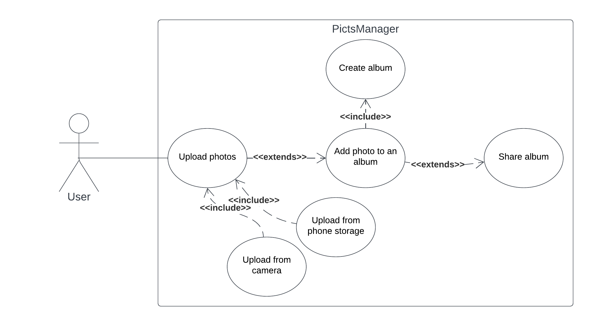
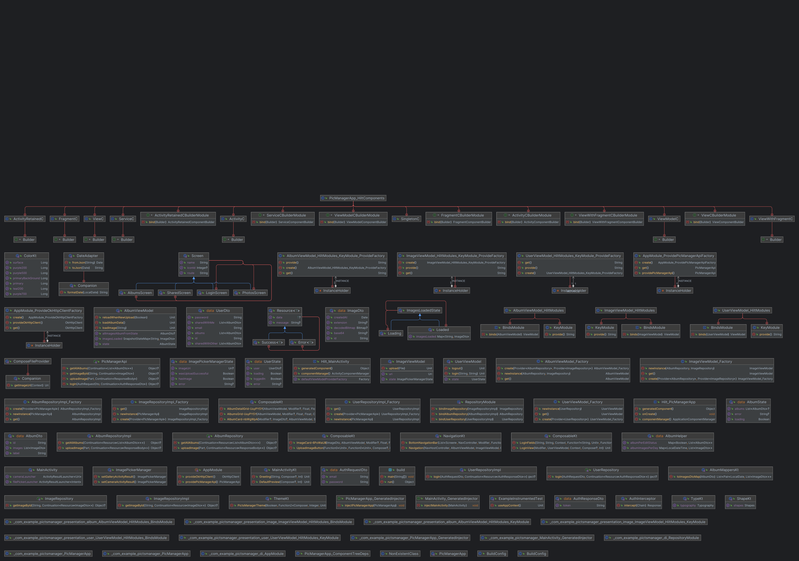
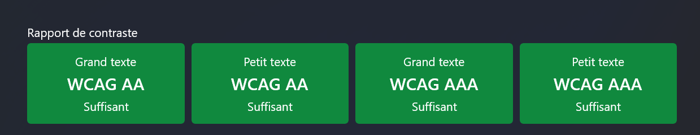

# T-DEV-800-RUN_1


Postman documentation: https://documenter.getpostman.com/view/17687133/2s93RWPBTn
## Goal of the project

**This is a school group project for Epitech.**

Build a mobile application and the associated server to take and share pictures. Pictures are classified in albums, that have an owner and a list of people who can view it
## Launch the project
Run the following command to launch the project:
```bash
make all
```
Make sure you have Docker installed on your machine. And make sure that make is installed on your machine. This command will build, test and deploy the project.
## Components
- A gallery application
- A distant server
- A distant database
## Functionalities
### Use-case diagram

### Class diagram
<div style="display:inline-block;overflow:hidden">
  
</div>

## Requirements
- The application only stores pictures’ names and associated ID. Pictures, metadatas and other informations are stored in the distant back server and can be retrieved and/or updated with specific requests.
- Pictures you take from your phone camera need to be compressed before being stored. You have to find a compromise between performance and quality, but the pictures should be visually acceptable.
## Specifications
### Accessibility

#### Material design
The application follows the Material Design guidelines.
### Test policy
`"Test-Last" development` or simply writing code without a strong emphasis on testing.

In Test-Last development, developers write code first, and then create tests after the code has been written. This approach can lead to a situation where tests are only written for the happy path, and edge cases or error scenarios are not tested thoroughly. This can lead to defects and issues being discovered later in the development process, when they are more difficult and costly to fix.

Test-Last development can also make it difficult to refactor code, as it is harder to ensure that changes to the code do not break existing functionality without a comprehensive set of tests in place.
### Images compression
Images are compressed before being sent to the server. The right compression ratio is found by testing the different compression ratios and the time it takes to send the image to the server. All views do not need the same compression ratio.

Image compression is handled when a user selects or takes a photo using the application. The selected image is first decoded to get its dimensions and then scaled down to a desired resolution (1920x1080) and compressed to 80% quality.

The scaled-down image is then compressed using JPEG format and saved as a temporary file. This compressed file and the original file are then passed to the view model to be uploaded to the server. The compressed image is then used as miniature in the app, while the original image is used for full-screen display.

When the uploaded image is displayed in the app, it is loaded asynchronously using the Coil library to reduce memory usage and prevent the app from crashing. 

### Questions
#### What is lossy and lossless image compression?
Lossy image compression refers to a method of compressing digital images in which some information is lost or discarded in order to achieve higher compression rates, while lossless image compression refers to a method that compresses the image without losing any information.
#### What are the advantages of lossy image compression over lossless image compression?
- **Smaller file sizes**: Lossy image compression algorithms can achieve much higher compression ratios compared to lossless compression algorithms, resulting in smaller file sizes. This is particularly useful in situations where storage space is limited or when images need to be transmitted over low-bandwidth networks.
- **Faster processing**: Lossy image compression algorithms are generally faster and require less processing power than lossless compression algorithms. This is because they do not have to encode and decode as much information as lossless algorithms.
- **Better compression of complex images**: Lossy image compression algorithms are better suited for compressing complex images such as photographs or images with a large number of colors. Lossless compression algorithms may result in larger file sizes for these types of images.
- **Reduced storage and bandwidth costs**: Smaller file sizes resulting from lossy image compression can lead to significant savings in storage and bandwidth costs. This is particularly important for large-scale applications such as websites or social media platforms that host large amounts of visual content.
#### Does JPEG image compression work equally well with all types of images?
- **Color vs. grayscale images**: JPEG compression works better for color images than grayscale images. This is because color images have more information to compress and more areas of detail, which can be compressed effectively using the discrete cosine transform (DCT) and quantization techniques used in JPEG compression.
- **Line drawings vs. continuous-tone images**: JPEG compression is generally not suitable for compressing line drawings or other images with sharp edges or lines. This is because JPEG compression is optimized for compressing continuous-tone images, such as photographs or other images with a wide range of colors and tones. Line drawings or other images with sharp edges and lines can become blurry or distorted after JPEG compression.
- **Natural landscape vs. manmade cityscape images**: The effectiveness of JPEG compression can also depend on the content of the image. Images with a lot of detail or high contrast, such as manmade cityscapes or images with a lot of texture, can be more difficult to compress effectively without losing quality. Images with less detail or more gradual transitions, such as natural landscapes or portraits, may compress more efficiently without losing as much detail.
#### What types of images compress "better"?
- **Images with fewer colors**: Images with fewer colors, such as graphics or charts, tend to compress better than images with more colors. This is because there are fewer color transitions to represent, and the resulting compressed image can be more uniform in color.
- **Images with fewer details**: Images with fewer details or a simpler structure, such as cartoons or diagrams, tend to compress better than images with more intricate details or textures. This is because the compression algorithm can represent the image with fewer high-frequency components, resulting in a smaller file size.
- **Images with less noise**: Images with less noise or smoother textures, such as portraits or landscapes, tend to compress better than images with more noise or graininess, such as photos taken in low light. This is because the compression algorithm can represent the image with fewer high-frequency components, resulting in a smaller file size.
#### What types of images compress "worse"?
- **Images with more colors**: Images with more colors, such as photographs or images with gradients, tend to compress worse than images with fewer colors. This is because there are more color transitions to represent, and the resulting compressed image can show more artifacts and loss of color fidelity.
- **Images with more details**: Images with more intricate details or textures, such as natural landscapes or high-resolution scans, tend to compress worse than images with fewer details or a simpler structure. This is because the compression algorithm may need to represent the image with more high-frequency components, resulting in a larger file size and potential loss of detail.
- **Images with more noise**: Images with more noise or graininess, such as photos taken in low light, tend to compress worse than images with less noise or smoother textures. This is because the compression algorithm may need to represent the image with more high-frequency components, resulting in a larger file size and potential loss of detail.
#### What should you look for when assessing image quality?
- **Resolution**: The resolution of an image refers to the number of pixels that make up the image. Higher resolution generally means more detail and sharper images, but can also result in larger file sizes.
- **Color accuracy**: Color accuracy refers to how well the colors in an image match the original colors in the scene being captured. Inaccurate colors can make images appear washed out or unnatural.
- **Contrast**: Contrast refers to the difference between the lightest and darkest parts of an image. High contrast can make images appear more vivid and dynamic, while low contrast can make them appear flat or dull.
- **Sharpness**: Sharpness refers to how well-defined the edges and details in an image are. Images that are too soft or blurry can appear out of focus, while images that are too sharp can appear exaggerated or unnatural.
- **Compression artifacts**: Compression artifacts are visual distortions that can occur when an image is compressed using a lossy compression algorithm. These can include blocky or pixelated areas, color banding, and other visual anomalies that can reduce image quality.
Noise: Noise refers to random fluctuations in image brightness or color that can be introduced by various factors, such as low light conditions or high ISO settings. Excessive noise can make images appear grainy or distorted.
- **Overall visual appeal**: Ultimately, the quality of an image also depends on subjective factors such as composition, lighting, and visual impact. A technically perfect image may not be visually appealing if it lacks emotional resonance or artistic value.